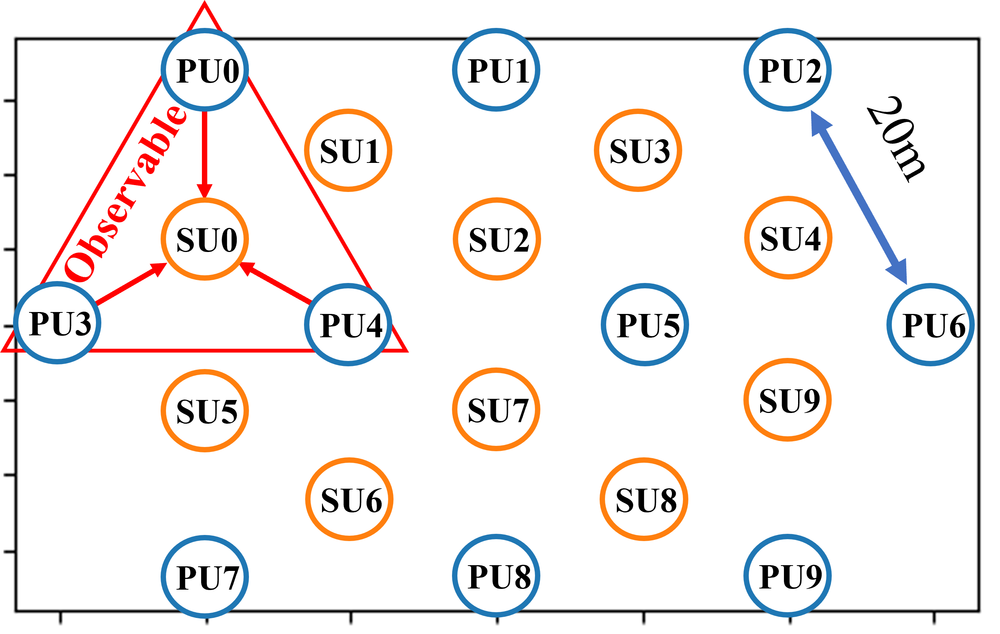

# Collaborative Learning Based Spectrum Sensing Under Partial Observations
## Introduction
This project is a distributed learning method based on decoupled heterogeneous CNNs to collaboratively learn and detect the wideband occupancy of a wireless environment. The primary users(PUs) using different bands are scattered in this environment. As a result, each secondary user (SU) can only observe the channels used by a few PUs nearby.  The baselines include standalone learning (with decision fusion), federated learning, and energy detection, which are also implemented.

## Environment setup
There are 10 PUs and each of them utilizes one or several bands. The location of PUs and SUs are shown in the fig:

  
## Data generation
The dataset is generated from given clean single-band signal PSDs (saved in 'clean_PSD_6mod_Mat.pth'). To generate the dataset, you need to run 'Feb2023datagenerator_SNR_Vol_Casexxx.ipynb' (where 'xxx' can be '1_2_3', '4', or '5').
The dataset file will be saved under 'RefinedNewData/SNRs/XXm_AlphaXXX/XXX(time water-print)/Data_SNRXXvolXX.pth'.
The path-loss exponent (alpha) for training data is uniformly set to 3.71. In testing please refer to the configurations of the 5 cases. 

## Run experiments
Run the ipynb files. Their name indicates the methods trained and tested in the file. The results will be saved in xlsx files according to the name of the method.

## Result documentation
TBD
